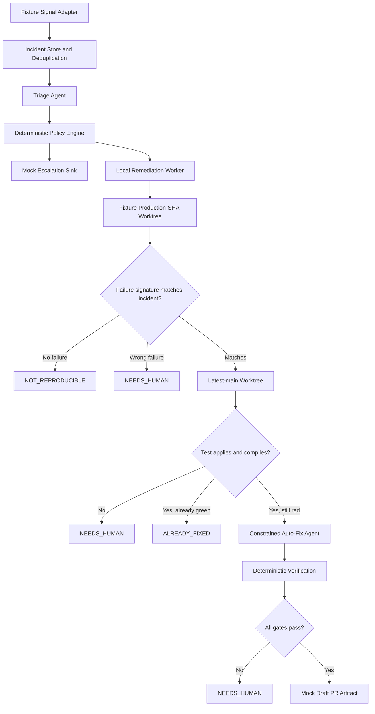

# Auto-Fix Remediation Kernel

Status: Revised design draft for review

Current milestone: learning sandbox with mock adapters

Future milestone: production integrations, explicitly frozen

## 1. Scope Decision

This project is currently a mechanism-learning sandbox, not a production incident-remediation service. `rpas-lms` has not accumulated production incidents, so building and operating real Sentry ingestion, a GitHub App, a deployed worker, repository rulesets, and production secrets now would be premature.

The work is split into two independent milestones:

### Build now: mechanism kernel

- mock health signals and incident fixtures;
- durable Incident and RemediationRun state;
- deterministic policy decisions;
- lease, heartbeat, retry, and state-transition behavior;
- production-SHA-style reproduction using fixture commits;
- latest-main-style repair in a second clean worktree;
- constrained repair and deterministic verification;
- mock escalation and mock Draft PR publication.

This milestone proves whether the mechanism is safe, understandable, recoverable, and useful. It does not require production infrastructure.

### Frozen: production adapters and operations

- signed Sentry webhook ingestion and polling reconciliation;
- a continuously deployed remediation worker;
- GitHub App authentication and real Draft PR publication;
- repository rulesets and bot identity restrictions;
- production secrets, test services, cleanup jobs, quotas, and rollout.

Frozen work must not be pulled into the current implementation merely because interfaces for it exist.

Production work may be reconsidered only after all of these conditions are true:

1. `rpas-lms` is launched and emits trustworthy production signals.
2. At least three real, repository-local incidents have been reproduced manually.
3. `pnpm autofix` has produced a valid repair proposal for at least one real defect.
4. The team still judges automation more valuable than improving ordinary diagnostics and tests.

The number three is an activation checkpoint, not evidence that three incidents form a useful classifier. The decision remains a human design review based on the incidents themselves.

## 2. Intended Value and Operating Characteristic

The current system's primary value is:

1. triage and evidence collection;
2. consistent escalation and handoff;
3. a verified Draft PR proposal for the small subset of suitable incidents.

This is deliberately a high-precision, low-recall system. Concurrency failures, environment configuration, dirty data, external-service behavior, performance failures, and production-only authorization boundaries will often end in `NOT_REPRODUCIBLE` or `NEEDS_HUMAN`. That is a safe and useful result when accompanied by strong evidence.

The initial Draft PR conversion rate may be in the single-digit percentages. This is a planning assumption, not a success target. The system must not weaken its gates to increase that number.

## 3. Authority and Safety Decisions

- The model recommends; deterministic code authorizes.
- The maximum future autonomous action is an isolated branch and GitHub Draft PR.
- A human always decides whether to merge or deploy.
- Escalation can happen immediately while an eligible isolated repair attempt continues.
- Eligibility is based on required capabilities and environmental constraints, not severity alone.
- No repair is presented as verified without a matching reproduction and red-to-green evidence.
- The worker cannot access production data, production credentials, merge APIs, deploy APIs, repository settings, or branch-protection controls.
- Current-milestone publishers and escalation sinks are mocks.

## 4. Current-Milestone Architecture



The database owns workflow state. Temporary worktrees are disposable execution environments. External systems are adapters, never the source of truth.

## 5. Component Responsibilities

### 5.1 Fixture Signal Adapter

Loads versioned incident fixtures that contain:

- a stable fingerprint;
- a fixture deployment commit;
- error type and stack frames;
- bounded event metadata;
- expected routing outcome.

Fixtures must include reproducible, already-fixed, wrong-failure, non-portable-test, policy-denied, and human-only cases.

### 5.2 Triage Agent

Triage is the diagnostic and routing layer. It correlates signals, inspects runtime evidence and code, proposes the likely cause, identifies ownership and required capabilities, and produces a validated assessment.

It does not edit code, grant itself authority, publish a PR, merge, deploy, or close an incident based on model confidence.

Its useful output exists even when no repair is attempted:

```ts
type TriageAssessment = {
  incidentFingerprint: string;
  severity: "P0" | "P1" | "P2" | "P3";
  suspectedRootCause: string;
  suspectedFiles: string[];
  deployedCommit: string;
  owningTeam: string;
  reproducibility: "likely" | "unknown" | "unlikely";
  requiredCapabilities: string[];
  escalationRecommended: boolean;
  autoFixRecommended: boolean;
  evidence: EvidenceReference[];
};
```

### 5.3 CodeGraph Evidence Provider

CodeGraph is a read-only grounding tool. It helps triage locate stack symbols and callers, helps reproduction find test seams, and helps review explain blast radius. It is neither a runtime oracle nor proof that a repair works.

Every query must be bound to the actual worktree and revision:

```ts
interface CodeSearch {
  explore(input: {
    query: string;
    repoRoot: string;
    revision: string;
  }): Promise<CodeEvidence>;
}
```

Using `process.cwd()` implicitly is unsafe when multiple worktrees exist.

### 5.4 Deterministic Policy Engine

The Policy Engine decides whether escalation is required, whether an attempt may start, and which limits apply. LLM output is evidence, not authorization.

An attempt is denied or escalated when it requires production credentials, production data mutation, destructive schema work, infrastructure changes, secret changes, deployment changes, an unbounded edit surface, or an unavailable local environment.

Initial repair limits:

- at most five changed files;
- at most 200 changed lines including the test;
- at most two model repair iterations;
- no writes to `.git`, `.env*`, `.github/workflows`, deployment files, infrastructure configuration, secrets, or `prisma/migrations`.

### 5.5 Local Remediation Worker

The current worker is an on-demand local process. It claims one run with a lease, heartbeats while working, records transitions, and safely resumes or expires abandoned work.

It is not yet a deployed service. Proving lease semantics locally is part of the mechanism exercise; operating a self-hosted runner is not.

### 5.6 Reproduction Agent

The reproduction agent may add or adjust only a bounded test and supporting test fixture in a clean worktree at the fixture deployment commit. It records the command, exit code, bounded logs, and observed failure signature.

A test is accepted as a reproduction only when:

1. it passes before the fixture defect is introduced, when that control is available;
2. it fails on the fixture deployment commit;
3. its observed failure signature matches the incident signature;
4. the failure is stable across repeated execution;
5. unrelated baseline tests do not fail.

Failure to meet these conditions produces evidence and stops automated repair.

### 5.7 Constrained Auto-Fix Agent

The fix agent receives a fresh latest-main worktree plus the accepted reproduction test. It may edit only policy-approved repository paths. It cannot weaken, skip, delete, or replace the accepted test merely to make it pass.

### 5.8 Deterministic Verification

Verification is ordinary code. It checks:

1. the accepted test failed with a matching signature before the fix;
2. the same test passes after the fix;
3. related tests pass;
4. the complete trusted suite passes;
5. type and schema checks pass;
6. diff and path policies pass;
7. no test, configuration, or policy weakening occurred.

The verifier can prove these observations. It cannot prove semantic correctness in general.

### 5.9 Mock Publisher and Escalation Sink

The current publisher writes a durable Draft PR-shaped artifact without network access. The mock escalation sink records who would be notified and why. These artifacts make idempotency and audit behavior testable without creating operational dependencies.

## 6. Matching a Reproduction to the Incident

“Fails for the expected reason” is not treated as a deterministic proof. It is a constrained matching rule.

The normalized incident signature contains:

```ts
type FailureSignature = {
  errorType: string;
  normalizedMessageClass?: string;
  applicationFrames: Array<{
    module: string;
    symbol?: string;
  }>;
};
```

The first kernel version accepts a reproduction only when the error type matches and at least two of the first three available application frames match by normalized module and, when available, symbol. Fixtures with fewer frames must define an explicit reviewed matcher.

This remains a heuristic. The first question in the human review checklist is therefore: “Does the red test fail for the same underlying reason as the incident?” The Draft PR artifact must show the incident and test signatures side by side.

## 7. Two-Worktree Flow and Test Portability

1. Create a clean reproduction worktree at the fixture deployment commit.
2. Produce and validate the matching red test there.
3. Create a separate clean worktree at latest main.
4. Attempt to apply only the reproduction test and required fixture changes.
5. Classify the result:
   - test applies, compiles, and is green: `ALREADY_FIXED`;
   - test applies, compiles, and remains red: continue to repair;
   - test cannot apply or compile because the seam changed: `NEEDS_HUMAN`;
   - test fails with a different signature: `NEEDS_HUMAN`.

The non-portable case is not evidence of an existing fix.

## 8. Durable State and Recovery

The mechanism kernel uses explicit records rather than a generic artifact blob:

- `Incident`: normalized identity, fingerprint, occurrence count, status, and latest evidence;
- `RemediationRun`: one workflow cycle and its phase;
- `RemediationAttempt`: lease, heartbeat, budgets, worktrees, and outcome;
- `Evidence`: immutable commands, bounded logs, signatures, code references, and test results;
- `ExternalAction`: idempotent mock publication or escalation intent.

State transitions use compare-and-set guards. A worker must hold the active lease to advance a run. Expired work may be reclaimed; external actions remain idempotent across retries.

## 9. Recurrence and Draft PR Idempotency

The stable key for an active remediation is:

```text
(repository, default branch, incident fingerprint)
```

Rules:

- repeated signals increment the occurrence count and attach new evidence to the same Incident;
- at most one open Draft PR artifact exists for that key;
- a newly verified attempt may supersede the artifact for the open remediation cycle rather than create another;
- an unverified recurrence is recorded but does not rewrite the proposal;
- if an earlier PR was merged or closed and the defect later recurs, create a new numbered remediation cycle linked to the prior cycle.

Future GitHub branch names include the fingerprint plus remediation-cycle number. They are not keyed by transient run ID.

## 10. MockTicket Has Two Separate Roles

`MockTicket` must not be discussed as one global concept:

1. In the existing SDLC `TICKETS` stage, it is a planning artifact and remains unchanged.
2. In the remediation prototype, it currently acts as glue between triage and auto-fix. That role is replaced by `Incident` and `RemediationRun` in the kernel.

This design does not remove or redesign the SDLC ticket stage.

## 11. Trusted Test-Suite Prerequisite

“The full suite passes” is a meaningful gate only when the suite and its environment are sufficiently hermetic.

Before the kernel can produce a verified Draft PR artifact:

- the full suite must pass in three consecutive clean runs on the baseline;
- required local services and fixture data must be reproducible;
- known flaky tests must be fixed or explicitly quarantined through human-reviewed test configuration;
- the auto-fix system may not silently ignore, retry away, or newly quarantine a failure.

An unrelated suite failure stops publication as `NEEDS_HUMAN` and is reported separately from repair failure.

## 12. Testing Strategy

Unit coverage includes fingerprinting, signature matching, policy decisions, transition guards, leases, path limits, verification classifications, and recurrence keys.

Integration scenarios include:

- duplicate fixtures produce one Incident;
- two workers race for one lease;
- a worker expires and another resumes safely;
- the red test matches the incident;
- the test is red for the wrong reason;
- latest main already contains a fix;
- the test cannot be ported to latest main;
- an eligible repair becomes a verified mock Draft PR;
- a recurrence updates one active cycle rather than producing duplicate proposals;
- a flaky unrelated test prevents publication with an honest classification.

The end-to-end current-milestone path is:

```text
fixture signal
→ Incident
→ triage evidence
→ deterministic policy
→ matching red test
→ constrained repair
→ deterministic verification
→ one mock Draft PR artifact
```

## 13. Delivery Plan

### K0: Establish a trustworthy baseline

- preserve the existing SDLC pipeline and user changes;
- define versioned incident and repository fixtures;
- prove three consecutive clean full-suite runs;
- document test-service setup and known non-hermetic tests.

Exit: the verification gate has a stable baseline.

### K1: Build the state and policy kernel

- add the minimal Incident, RemediationRun, Attempt, Evidence, and ExternalAction representation;
- implement transition guards, leases, heartbeat, expiry, retry, and cancellation;
- implement fixture ingress, deterministic policy, mock escalation, and mock publication.

Exit: crashes and duplicate fixture delivery do not create duplicate work or actions.

### K2: Prove reproduction semantics

- create fixture commits for reproducible, wrong-reason, already-fixed, and non-portable cases;
- implement revision-bound CodeGraph access;
- implement failure-signature matching;
- implement the two-worktree classification flow.

Exit: only a stable matching failure reaches repair.

### K3: Prove constrained repair and verification

- adapt the existing auto-fix primitive to the latest-main fixture worktree;
- enforce file, diff, command, iteration, and time budgets;
- implement deterministic gates and the human-review artifact;
- run the complete fixture matrix.

Exit: a mock Draft PR artifact is impossible without matching red-to-green evidence and every trusted gate passing.

## 14. Frozen Production Plan

After the activation conditions in Section 1 are met, production work requires a new design review. The likely sequence is:

1. real Sentry webhook plus polling reconciliation in shadow mode;
2. a separately deployed worker and real GitHub Draft PR publisher;
3. local-patch mode followed by restricted Draft PR mode.

That review must cover the operational surface currently out of scope:

- worker host, sandboxing, concurrency, cleanup, and availability;
- repository checkout and worktree storage;
- hermetic Postgres and other test services;
- GitHub App private key, webhook secret, and Sentry token storage and rotation;
- GitHub permissions and repository rulesets;
- per-incident model, compute, storage, and external API cost;
- quotas, abuse controls, audit retention, alerting, and disaster recovery.

Interfaces may anticipate these adapters, but current code must not implement them speculatively.

## 15. Metrics and Feedback

Report two value streams separately.

Triage and evidence value:

- percentage of incidents with useful ownership and evidence;
- time to first structured diagnosis;
- duplicate correlation rate;
- escalation usefulness and human correction rate;
- `NOT_REPRODUCIBLE` and `NEEDS_HUMAN` reason distribution.

Repair value:

- percentage reaching reproduction;
- percentage reaching a verified proposal;
- human acceptance, rejection, and false-fix rate;
- time from matching reproduction to proposal;
- cost per attempted and accepted repair.

The first version has no automatic policy-learning loop. Review outcomes are inspected periodically and policy configuration is changed manually through normal code review. High rejection rates in a module should cause humans to narrow or disable its eligibility.

## 16. Current-Milestone File Boundary

Expected new framework area:

```text
src/lib/agents/remediation/
  types.ts
  coordinator.ts
  lease.ts
  policy.ts
  worktrees.ts
  reproduction.ts
  verification.ts
```

Expected adapters:

```text
src/lib/agents/remediation/adapters/
  fixtureSignal.ts
  mockEscalation.ts
  mockPublisher.ts
```

Existing code may be adapted only where needed:

- triage becomes evidence-producing and revision-aware;
- auto-fix becomes a constrained repair primitive;
- local CLI commands trigger the coordinator;
- the SDLC PRD/RFC/TICKETS pipeline remains intact.

No Sentry route, GitHub client, deployed-worker entry point, repository ruleset, or production secret is part of this milestone.

## 17. Current-Milestone Acceptance Criteria

- Fixture duplicates create one Incident and increment occurrences.
- Policy decisions are reproducible and cannot be overridden by model output.
- Worker recovery does not duplicate attempts or external-action artifacts.
- Reproduction requires a stable failure whose signature matches the incident.
- A wrong-reason red test cannot reach repair.
- A non-portable test becomes `NEEDS_HUMAN`.
- An already-fixed case becomes `ALREADY_FIXED` without a proposal.
- A repair demonstrates matching red-to-green behavior and passes the trusted suite.
- Recurrence creates at most one open proposal per fingerprint and cycle.
- MockTicket remains available to the SDLC `TICKETS` stage but is not remediation workflow state.
- Every model call, tool action, command, transition, decision, and result is auditable.
- All current-milestone tests run without Sentry, GitHub, deployed workers, or production credentials.

## 18. Non-Goals of the Current Milestone

- real Sentry ingestion;
- real GitHub publication;
- a continuously deployed worker;
- automatic merge or deployment;
- production database or infrastructure repair;
- secret or repository-setting changes;
- maximizing the number of generated patches;
- automatic learning from reviewer feedback;
- broad multi-repository remediation.
