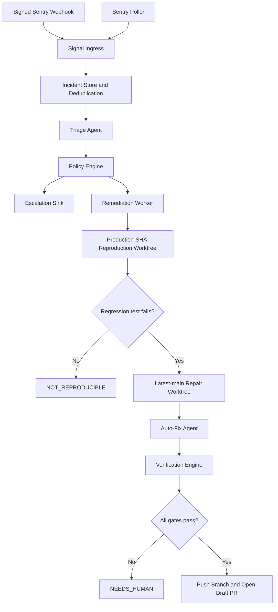

# Production Auto-Fix Remediation Framework

Status: Design draft for review
Scope: `rpas-lms` production health signals, triage, isolated remediation, verification, and GitHub Draft PR creation

## 1. Objective

Build a production-oriented remediation system that detects unhealthy application states, gathers evidence, decides whether an automated repair attempt is safe, reproduces the issue, prepares a verified fix in isolation, and opens a GitHub Draft PR for human review.

The system never merges, deploys, changes branch protection, writes repository secrets, or performs destructive production data operations.

The primary value is not autonomous deployment. It is reducing the time from a production signal to a reproducible, reviewed, evidence-backed repair proposal.

## 2. Confirmed Decisions

- The maximum autonomous action is pushing an isolated branch and opening a Draft PR.
- A human always decides whether to merge.
- When an incident requires senior or privileged human involvement, escalation happens immediately while an isolated repair attempt may continue in parallel.
- Auto-fix eligibility is capability-based, not determined only by incident severity or model confidence.
- A Draft PR requires a reproducible failing test, a fix, and successful verification.
- Reproduction uses the exact production deployment commit.
- The final repair uses a clean worktree from the latest default branch.
- If the issue no longer reproduces on the latest default branch, the result is `ALREADY_FIXED` and no repair PR is created.
- Production ingestion uses both signed Sentry webhooks and periodic polling reconciliation.
- Long-running work executes in a separate worker, not inside a Next.js request or serverless function.
- Sentry and GitHub are real production integrations in the first complete production slice.
- The bot cannot merge or deploy: the worker exposes no merge/deploy operation and repository rulesets prevent the bot identity from bypassing human review or pushing to the default branch.

## 3. Why the Current Prototype Is Not the Production Framework

The current implementation proves useful primitives:

- a generic LLM tool loop;
- structured triage output;
- CodeGraph-based code lookup;
- worktree isolation;
- persisted run and step records;
- mock issue creation;
- local patch generation.

However, the current triage and auto-fix CLIs each own an entire transaction script. They mix event ingestion, model decisions, database state, side effects, recovery, and presentation. This works for a sandbox but creates production gaps:

- webhook and polling races can process one issue more than once;
- a process crash can leave ambiguous or unrecoverable state;
- model recommendations and authority decisions are not cleanly separated;
- no production-commit reproduction gate exists;
- the current fix agent does not prove a red-to-green regression test cycle;
- external actions do not have durable idempotency records;
- one generic `AgentRun.artifacts` payload cannot clearly represent incidents, attempts, evidence, test results, and PRs;
- the current mock ticket acts as both an external ticket and internal workflow glue.

The proposed work is therefore a framework-level addition around reusable existing primitives, not a wholesale rewrite of every agent.

## 4. Target Architecture



The database owns durable workflow state. The worker owns temporary execution. Sentry, GitHub, email, and future Jira integrations are external projections, not the source of truth.

## 5. Component Responsibilities

### 5.1 Signal Ingress

Accepts health signals from Sentry and future providers.

Responsibilities:

- verify webhook signatures before parsing payloads;
- enforce request size and content-type limits;
- normalize webhook and polling payloads into `HealthSignal`;
- compute a stable incident fingerprint;
- store or update one Incident idempotently;
- enqueue or wake remediation work;
- return quickly without invoking an LLM.

Webhook and polling use the same normalization and deduplication path. Polling exists to reconcile missed or delayed webhooks.

### 5.2 Triage Agent

The triage agent is the diagnostic and routing layer. It does not write code, create its own permissions, merge, deploy, or close incidents based only on model confidence.

Responsibilities:

- correlate related signals and detect likely duplicates;
- inspect stack traces, releases, deployment metadata, existing incidents, and CodeGraph evidence;
- identify likely root causes and affected modules;
- estimate user and business impact;
- identify the owning team and requested reviewers;
- describe the capabilities required to attempt repair;
- recommend escalation and auto-fix eligibility;
- emit a validated `TriageAssessment`.

Suggested output shape:

```ts
type TriageAssessment = {
  incidentFingerprint: string;
  severity: "P0" | "P1" | "P2" | "P3";
  suspectedRootCause: string;
  suspectedFiles: string[];
  deployedCommit: string;
  owningTeam: string;
  duplicateOf?: string;
  reproducibility: "likely" | "unknown" | "unlikely";
  requiredCapabilities: string[];
  escalationRecommended: boolean;
  autoFixRecommended: boolean;
  evidence: EvidenceReference[];
};
```

The model recommendation is evidence for the Policy Engine, not authorization.

### 5.3 CodeGraph Evidence Provider

CodeGraph is a read-only grounding tool used to connect runtime evidence to real code.

Uses by phase:

- triage: locate stack symbols, callers, tests, ownership, and probable blast radius;
- reproduction: find the best test seam and relevant fixtures;
- repair: inspect callers and invariants before editing;
- verification: compare the changed files with the expected blast radius;
- Draft PR: publish affected-module and call-path evidence.

CodeGraph is not proof of runtime behavior and cannot replace a failing test.

Every query must be bound to a repository root and revision:

```ts
interface CodeSearch {
  explore(input: {
    query: string;
    repoRoot: string;
    revision: string;
  }): Promise<CodeEvidence>;
}
```

This corrects the current `process.cwd()` behavior, which can query the wrong checkout when auto-fix runs inside a worktree.

### 5.4 Policy Engine

The Policy Engine is deterministic code, not an LLM agent.

It decides:

- whether immediate escalation is required;
- whether an automated repair attempt may start;
- which capability profile the attempt receives;
- which budgets and file restrictions apply;
- which reviewer group is required.

Auto-fix eligibility requires:

- a known repository and production commit;
- a repository-local change;
- an isolated, non-production test environment;
- no production credential requirement;
- no destructive production data operation;
- no branch-protection, secret, or deployment modification;
- bounded files, diff size, execution time, and model/tool budgets.

Incident severity controls notification urgency. It does not by itself determine whether a safe isolated repair attempt is possible.

### 5.5 Remediation Worker

A separate long-running worker claims and executes remediation attempts.

Responsibilities:

- atomically claim eligible work;
- maintain a lease with owner and expiry;
- heartbeat during long-running stages;
- resume expired attempts safely;
- enforce per-repository and global concurrency limits;
- enforce attempt and retry budgets;
- invoke phase-specific components;
- persist phase transitions, evidence, errors, and artifacts;
- clean up temporary worktrees.

The worker must not rely on an in-memory queue for correctness.

### 5.6 Reproduction Agent

The reproduction agent operates in a clean worktree at the exact production deployment commit.

Allowed actions:

- read repository files;
- query revision-bound CodeGraph evidence;
- create or modify test files;
- run allowlisted test and diagnostic commands;
- write reproduction notes and logs.

Required result:

- a deterministic regression test that fails for the expected reason.

If no stable failing test can be produced, the result is `NOT_REPRODUCIBLE` or `NEEDS_HUMAN`. It cannot proceed to a verified Draft PR.

### 5.7 Auto-Fix Agent

The auto-fix agent operates in a second clean worktree based on the latest default branch.

Before editing:

- apply the reproduction test;
- run it against latest main;
- return `ALREADY_FIXED` if it already passes;
- continue only if it fails for the same reason.

During repair:

- modify only repository-local files;
- use a restricted read/write toolset;
- use allowlisted commands only;
- obey file-count, diff-size, time, token, and tool-call budgets;
- avoid unrelated formatting or refactoring;
- preserve the regression test;
- stop and request human help if the repair exceeds its capability profile.

The auto-fix agent does not own worktree lifecycle, GitHub publishing, policy, or final verification.

### 5.8 Verification Engine

The Verification Engine is deterministic code.

Required gates:

1. The regression test fails on the original production code.
2. The same regression test fails on latest main before the patch, unless classified `ALREADY_FIXED`.
3. The regression test passes after the patch.
4. Related tests pass.
5. The complete test suite passes.
6. Type checking and schema validation pass.
7. The diff stays within the granted file and size budgets.
8. Forbidden paths and generated secrets are absent.
9. The changed modules agree with the expected CodeGraph blast radius.

An LLM may summarize verification evidence but cannot override a failed deterministic gate.

### 5.9 GitHub Publisher

The GitHub publisher executes only after all verification gates pass.

Responsibilities:

- create a deterministic branch name;
- commit the regression test and repair;
- push the isolated branch;
- create one Draft PR idempotently;
- attach incident, evidence, test, risk, and CodeGraph summaries;
- request the owning reviewers;
- store the branch, commit, and PR identifiers as external actions.

The GitHub App receives only the repository permissions required to push repair branches and manage pull requests. Repository rulesets must independently block the bot identity from pushing to the default branch or bypassing required human review. The worker exposes no merge operation and receives no deployment or repository-administration credential.

### 5.10 Escalation Sink

Escalation is independent from auto-fix execution.

For urgent or privileged incidents:

- notify the responsible human immediately;
- include current evidence and production impact;
- continue an eligible isolated repair attempt in parallel;
- update the notification when reproduction, verification, or Draft PR status changes.

Initial sinks may include GitHub reviewer requests and email. Slack or PagerDuty can be added behind the same interface.

## 6. Worktree Strategy

Each attempt uses two short-lived worktrees:

```text
/tmp/remediation/<runId>/reproduce  # exact production commit
/tmp/remediation/<runId>/fix        # latest default branch
```

The reproduction worktree proves the observed production failure. The repair worktree ensures the proposed PR applies to current code.

Both worktrees must:

- receive no production secrets;
- use an isolated test database and service dependencies;
- reject absolute paths and path escapes;
- reject `.git`, `.env`, secret, deployment, and credential paths;
- be cleaned by a finally path and a periodic orphan sweeper;
- record their base SHA before execution.

## 7. Durable State Model

The production framework should add dedicated models instead of overloading `AgentRun.artifacts`.

### Incident

- source and external ID;
- stable fingerprint;
- environment and release SHA;
- first/last seen timestamps;
- occurrence and affected-user counts;
- lifecycle status;
- raw signal digest and normalized data.

### RemediationRun

- incident relation;
- policy decision;
- escalation state;
- production and default-branch SHAs;
- current phase and terminal result;
- Draft PR reference, when present.

### RemediationAttempt

- attempt number;
- lease owner and expiry;
- phase, start, finish, and heartbeat timestamps;
- capability profile and budgets;
- failure category and sanitized error.

### Evidence

- evidence type and phase;
- source revision;
- structured metadata;
- bounded text or artifact reference.

### ExternalAction

- action type;
- stable idempotency key;
- provider and external ID;
- request status and result metadata.

Required uniqueness includes:

- `(source, externalId)`;
- stable incident fingerprint policy;
- `(runId, attemptNumber)`;
- `(runId, actionType, idempotencyKey)`.

## 8. Workflow State Machine

```text
RECEIVED
→ TRIAGING
→ CLASSIFIED
→ REPRODUCING
→ FIXING
→ VERIFYING
→ DRAFT_PR_OPENED

Alternative terminal states:
ALREADY_FIXED
NOT_REPRODUCIBLE
NEEDS_HUMAN
FAILED
CANCELLED
```

Escalation is a parallel timestamp and status, not a terminal workflow state.

Every phase transition must be conditional on the expected previous phase and current lease owner.

## 9. MockTicket Position

The current `MockTicket` is useful as a sandbox Jira adapter and test fixture. It currently also connects triage to auto-fix through `ticketKey → runId → decision`.

That coupling must not become the production workflow contract.

Target position:

- retain `MockIssueTracker` for unit and integration tests;
- optionally project an Incident into Jira in the future;
- never use ticket existence as the source of remediation state;
- connect triage and auto-fix through Incident and RemediationRun IDs;
- treat Jira tickets, GitHub issues, and Draft PRs as external actions.

## 10. Permission Matrix

| Component | Read code | Write code | Run tests | Network | Push branch | Merge/deploy |
|---|---:|---:|---:|---:|---:|---:|
| Signal ingress | No | No | No | Sentry only | No | No |
| Triage agent | Yes | No | No | Read-only integrations | No | No |
| Policy Engine | No | No | No | No | No | No |
| Reproduction agent | Yes | Tests only | Allowlist | No production services | No | No |
| Auto-fix agent | Yes | Scoped worktree | Allowlist | Restricted | No | No |
| Verification Engine | Yes | No | Allowlist | Test dependencies only | No | No |
| GitHub publisher | Repository metadata | No edits | No | GitHub only | Yes | No |
| Escalation sink | Evidence only | No | No | Approved sinks | No | No |

## 11. Error Handling and Recovery

- Webhook processing stores signals idempotently before returning success.
- Polling retries provider failures without creating duplicate incidents.
- Worker claims use database leases with heartbeats and expiry.
- A crashed worker cannot commit a later phase after losing its lease.
- External actions use durable idempotency keys.
- Worktree cleanup failure is recorded and retried by an orphan sweeper.
- Provider errors distinguish retryable, permanent, authorization, and policy failures.
- Sensitive command output and environment values are redacted before persistence.
- Retry limits are explicit per phase; exhausted attempts become `NEEDS_HUMAN`.

## 12. Testing Strategy

### Unit tests

- signal normalization and fingerprinting;
- policy eligibility and capability profiles;
- state transition guards;
- lease ownership and expiry;
- tool input and path validation;
- verification result classification;
- Draft PR idempotency keys.

### Integration tests

- webhook and polling delivery of the same Sentry issue;
- two workers racing for one attempt;
- worker crash and lease recovery;
- production-SHA reproduction followed by latest-main repair;
- `ALREADY_FIXED` detection;
- failure after external action request and safe retry;
- orphaned worktree cleanup;
- GitHub adapter against a fake server or recorded contract fixture.

### End-to-end test

```text
Sentry fixture
→ one Incident
→ structured triage
→ policy approval
→ failing regression test
→ verified repair
→ one mock Draft PR
```

### Security tests

- invalid webhook signatures;
- path traversal and symlink escapes;
- writes to forbidden files;
- disallowed shell commands;
- secret redaction;
- GitHub token permission assumptions;
- prompt-injected Sentry fields attempting to alter policy or tools.

## 13. Delivery Plan

### Phase 0: Preserve the Current Baseline

- finish or separately commit the current agent hardening work;
- keep the SDLC pipeline operational;
- document current fixture-based triage and mock auto-fix behavior;
- avoid mixing remediation architecture changes with unrelated SDLC stages.

Exit criterion: clean baseline with existing tests passing.

### Phase 1: Remediation Domain and Worker Kernel

- add Incident, RemediationRun, RemediationAttempt, Evidence, and ExternalAction models;
- implement phase transitions, lease claims, heartbeat, expiry, and cancellation;
- add mock signal and mock external-action adapters;
- make the existing CLI invoke the coordinator instead of owning workflow state.

Exit criterion: crash-recoverable mock workflow with no duplicate attempt or external action.

### Phase 2: Triage and Policy Separation

- convert triage output to `TriageAssessment`;
- add revision-bound CodeGraph evidence;
- implement deterministic Policy Engine;
- remove ticket creation and workflow transitions from the triage agent;
- add immediate escalation as a parallel action.

Exit criterion: model recommendations cannot grant capabilities or bypass policy.

### Phase 3: Reproduction and Verification

- implement production-SHA and latest-main worktree lifecycle;
- add the reproduction agent and red-test evidence;
- constrain auto-fix writes and command execution;
- implement deterministic verification gates;
- record test commands, exit codes, and bounded logs.

Exit criterion: no Draft PR artifact is possible without verified red-to-green evidence and passing gates.

### Phase 4: Real Sentry Ingress

- implement signed webhook endpoint;
- implement Sentry API poller;
- normalize and deduplicate both paths;
- extract release SHA and reject auto-fix when revision identity is unavailable;
- retain fixture adapters for tests.

Exit criterion: webhook loss is repaired by polling without duplicate incidents.

### Phase 5: GitHub Draft PR Publisher

- push deterministic branches;
- create idempotent Draft PRs;
- attach evidence, verification, risk, and reviewer information;
- validate the least-privilege GitHub credential;
- persist every external action.

Exit criterion: retries create at most one branch/PR, and repository rulesets plus worker capabilities prevent bot merge or deployment.

### Phase 6: Production Rollout

1. Shadow mode: triage, policy, and evidence only.
2. Local patch mode: reproduce and repair, but do not push.
3. Draft PR mode: push and create real Draft PRs.

Measure:

- duplicate incident rate;
- reproducible incident rate;
- verified repair rate;
- false-fix rate during human review;
- time to diagnosis and Draft PR;
- human rejection reasons;
- worker retry and recovery rate;
- model, test, and compute cost per incident.

## 14. Expected File-Level Changes

New framework area:

```text
src/lib/agents/remediation/
  types.ts
  coordinator.ts
  worker.ts
  lease.ts
  policy.ts
  worktrees.ts
  reproduction.ts
  verification.ts
  trace.ts
```

New integrations:

```text
src/lib/agents/integrations/sentry/
  client.ts
  normalize.ts
  poller.ts
  webhook.ts

src/lib/agents/integrations/github/
  client.ts
  publisher.ts

app/api/integrations/sentry/webhook/route.ts
scripts/agents/remediation-worker.ts
```

Existing code to adapt:

- `src/lib/agents/runtime.ts`: structured output, cancellation, capability and budget hooks;
- `src/lib/agents/triage/*`: evidence-producing triage only;
- `src/lib/agents/autofix/*`: reproduction and repair stages only;
- `scripts/agents/triage.ts`: local/admin trigger, not workflow owner;
- `scripts/agents/autofix.ts`: local/admin trigger, not workflow owner;
- `prisma/schema.prisma`: dedicated remediation models and constraints.

Existing code to retain:

- SDLC PRD/RFC pipeline;
- CodeGraph integration concept;
- Zod validation patterns;
- Prisma client;
- current test infrastructure;
- MockIssueTracker as a test adapter.

## 15. Non-Goals

- automatic merge;
- automatic production deployment;
- production database repair;
- automatic infrastructure changes;
- automatic secret rotation;
- broad multi-repository repair in the first release;
- replacing human incident command;
- using an LLM as the final verification or authorization mechanism.

## 16. Acceptance Criteria

- Repeated webhook and polling events create one Incident.
- A production release maps to an exact repository commit.
- P0/P1 incidents notify humans immediately without necessarily stopping an eligible isolated repair attempt.
- Reproduction proves a failing test on production code.
- Latest main is checked before modification.
- Already-fixed issues do not produce redundant PRs.
- A verified repair demonstrates red-to-green behavior.
- Related tests, full tests, type checking, schema checks, and diff policy pass.
- Worker crashes recover through leases without duplicate attempts or external actions.
- GitHub retries create at most one Draft PR.
- Repository rulesets plus worker capability restrictions prevent bot merge, deployment, default-branch push, and repository-setting changes.
- Every model call, tool action, command, phase transition, verification result, and external action is auditable.

## 17. Initial Production Defaults

The first capability profile uses these explicit defaults:

- escalation uses email plus GitHub reviewer requests; Slack or PagerDuty is a later adapter;
- Sentry release data must resolve to an exact Git commit; otherwise auto-fix is blocked and the incident is escalated with diagnostics;
- forbidden repair paths include `.git`, `.env*`, secret files, `.github/workflows`, deployment manifests, infrastructure configuration, and `prisma/migrations`;
- a repair attempt may change at most five files and 200 total diff lines, including its regression test;
- a repair attempt may perform at most two model repair iterations;
- failure to reproduce produces diagnostic evidence only; no unverified patch is retained or presented as a repair;
- repository rulesets require human approval and prevent the bot identity from pushing to the default branch or bypassing review.

These defaults are intentionally conservative and can be changed through reviewed policy configuration after production evidence exists.
